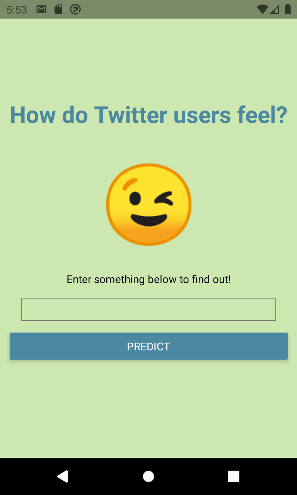

### WhatsTheMood

#### About

A Twitter sentiment analyzer developed using Google AutoML Natural Language Sentiment analysis API, Twitter's API, Spring Boot, Maven, Java, expo and React Native

To use the app the user enters a topic or hashtag they want in the search box and is returned a sense of how people feel about that item.

#### Tested

Tested on iOS Simulator and Android Emulator

#### Limitations

The app only supports twitter content in English,
The app does not rotate
